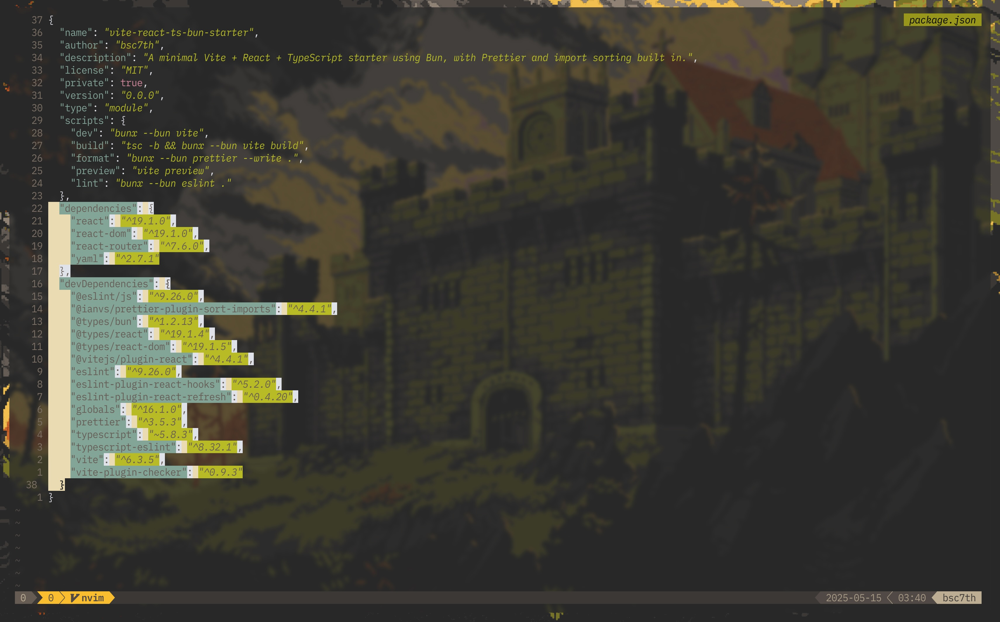

# Vite + React + TypeScript Starter (Bun Edition)



> ⚠️ Note: Some configuration files (e.g., ESLint, Prettier, TypeScript) are adapted from [craftzdog's smooth-toc-example](https://github.com/craftzdog/smooth-toc-example). These files are reproduced with credit for educational and starter purposes.

A minimal Vite + React + TypeScript starter powered by **Bun**, with **Prettier**, **import sorting**, and **type-checking** via `vite-plugin-checker` — for a fast and consistent dev experience.

## Tech Stack

- [Vite](https://vitejs.dev/)
- [React](https://reactjs.org/)
- [TypeScript](https://www.typescriptlang.org/)
- [Bun](https://bun.sh/)
- [Prettier](https://prettier.io/)
- [IanVS/prettier-plugin-sort-imports](https://github.com/IanVS/prettier-plugin-sort-imports)
- [fi3ework/vite-plugin-checker](https://github.com/fi3ework/vite-plugin-checker)


## Features

- Ultra-fast dev server and build via Vite + Bun
- Lightweight and minimal dependencies
- Prettier for consistent code formatting
- Sorted and grouped imports automatically
- Type-safe with TypeScript and additional text editor and IDE diagnostics via vite-plugin-checker

## Getting Started

```bash
git clone https://github.com/bsc7th/vite-react-ts-bun-starter.git
cd vite-react-ts-bun-starter
bun install
```

## Development

```bash
bun run dev
```

## Linting & Formatting

```bash
bun run format
```

## Build for Production

```bash
bun run build
```

> ⚠️ Note for Neovim users:
If you’re using a text editor like Neovim and import alias resolution (e.g. @/components/...) isn’t working, make sure your TypeScript LSP (ts_ls) is correctly configured.

Update your LSP setup to explicitly register ts_ls with the proper filetypes and root directory detection:

```lua
tsserver = {
  filetypes = { "typescript", "typescriptreact", "javascript", "javascriptreact" },
  root_dir = require("lspconfig.util").root_pattern("tsconfig.json", "package.json", ".git"),
}
``` 

This ensures the language server correctly picks up your tsconfig.json paths and resolves aliases like @/ properly.

## License

MIT - [bsc7th](basc7th/vite-react-ts-bun-starter)

## Credits

This starter was inspired by [Takuya Matsuyama (aka craftzdog / @devaslife)](https://github.com/craftzdog) and his excellent YouTube video:  
[**How to build a smoothly animated table of contents (by a bonfire🔥) w/ Bun, Framer Motion, Zustand**](https://www.youtube.com/watch?v=4g26x6FzuBU)

While this project is a simplified React starter focused on development tooling and project setup, you can explore his [repository](https://github.com/craftzdog/smooth-toc-example) to see how he integrates additional technologies.
